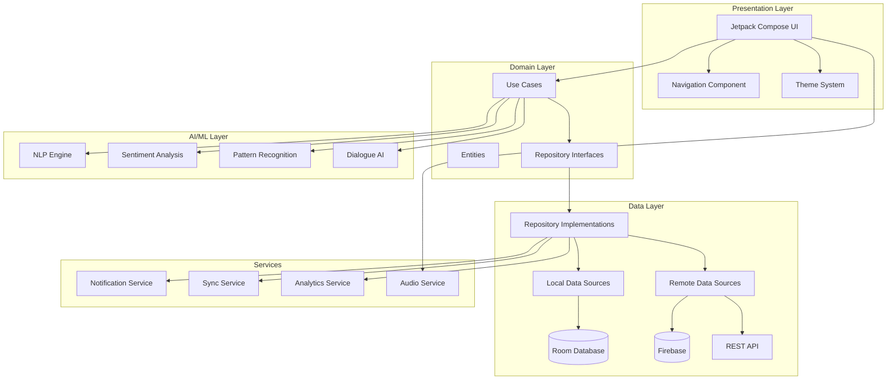

# Stoic Wisdom - Extraordinary Android Application Plan

## 1. Vision & Purpose

**Stoic Wisdom** is a revolutionary Android application that transforms ancient Stoic philosophy into a daily companion for modern life. Unlike other philosophy apps, we integrate **unique features** that make Stoicism a living practice rather than just reading material. Our goal is to create an immersive, comfortable UI experience that hooks users and keeps them engaged on their journey to wisdom and tranquility.

### Core Differentiators
- **AI-Powered Personal Stoic Mentor** - Contextual wisdom adapted to your life situations
- **Real-Time Emotional Response System** - Immediate Stoic guidance during challenging moments
- **Practical Challenge System** - Gamified Stoic exercises (negative visualization, voluntary discomfort)
- **Community Symposium** - Anonymous sharing of struggles with Stoic peer support
- **Journaling with Philosophical Analysis** - AI analyzes your thoughts through Stoic lens
- **Virtue Progress Tracking** - Track development of the four cardinal virtues
- **Stoic Crisis Mode** - Emergency guidance for high-stress situations
- **Historical Context Engine** - Learn how Stoics faced similar challenges

---

## 2. Unique Features (That No Other App Has)

### 2.1 The Stoic Compass™
**Revolutionary Navigation System**
- Real-time "compass" that points toward virtuous action in any situation
- Input current dilemma → Receive guidance from Marcus Aurelius, Epictetus, Seneca perspectives
- Visual representation showing alignment with four cardinal virtues (Wisdom, Justice, Courage, Temperance)
- "What would a Stoic do?" decision tree with contextual examples
- Save decisions and reflect on outcomes later

### 2.2 Dichotomy of Control Analyzer™
**Instant Situation Assessment**
- Quick-add stressful situations via text or voice
- AI automatically categorizes elements into "Within Control" vs "Outside Control"
- Visual chart showing energy distribution
- Guided reframing exercises to redirect focus
- Progress tracking: see how your perception shifts over time
- Integration with calendar to catch recurring stress patterns

### 2.3 Negative Visualization Studio™
**Safe Space for Stoic Practice**
- Guided negative visualization exercises (praemeditatio malorum)
- Customizable scenarios based on your actual life
- Gentle introduction to mortality contemplation (memento mori)
- Build emotional resilience through controlled exposure
- Journal integration to track gratitude increases
- Morning/Evening routines with adjustable intensity

### 2.4 Virtue Forge™
**Character Development Gamification**
- Four skill trees representing cardinal virtues
- Daily micro-challenges to develop each virtue
- Achievement system tied to real philosophical progress
- "Forge Points" earned through consistent practice
- Unlock deeper philosophical teachings as you progress
- Visual character evolution (your "Stoic avatar" grows wiser)

### 2.5 Impulse Interruption System™
**Break Reactive Patterns**
- One-tap "Pause" button for intense emotional moments
- Immediate grounding exercise (breathing + reframing)
- Countdown timer enforcing reflection before reaction
- Logs emotional triggers and patterns
- Suggests relevant Stoic passages based on emotion type
- Integration with phone sensors (heart rate if available) to auto-trigger

### 2.6 Philosophical Dialogue Engine™
**Conversational Learning**
- Chat with AI embodiments of Stoic philosophers
- Ask questions about modern problems (relationships, career, technology)
- Socratic dialogue mode: AI asks YOU questions to develop wisdom
- Multiple difficulty levels from beginner to advanced
- Save conversations as study material
- Share insights anonymously with community

### 2.7 Stoic Weather Report™
**Daily Philosophical Forecast**
- Morning briefing: "Today's Philosophical Weather"
- Analyzes your calendar, habits, and patterns
- Predicts likely challenges and suggests preparation
- Evening review: reflect on how you handled the "weather"
- Seasonal philosophical themes (aligned with natural cycles)
- Custom forecasts based on personal growth areas

### 2.8 Ancient Wisdom Modern Context™
**Bridge Past & Present**
- Match modern situations to historical Stoic examples
- "Marcus Aurelius faced plague, you face pandemic" parallels
- Timeline showing how Stoics handled:
  - Loss and grief
  - Political turmoil
  - Exile and isolation
  - Betrayal
  - Success and fame
  - Physical suffering
- Extract timeless principles from historical context

### 2.9 Community Symposium™
**Anonymous Philosophical Support**
- Share struggles without judgment
- Receive Stoic-framed support from community
- Vote on most helpful Stoic reframings
- Weekly philosophical discussions on common themes
- Mentorship pairing (experienced Stoics guide newcomers)
- Optional local meetup coordination
- Moderated to ensure philosophical depth

### 2.10 Premeditatio Malorum Vault™
**Preparedness Repository**
- Pre-written responses to common adversities
- Your personal "Stoic emergency manual"
- Templates for grief, failure, betrayal, loss
- Practice scenarios before they happen
- Quick access during actual crises
- Evolves based on your growth

---

## 3. Comfortable & Addictive UI Design

### 3.1 Design Philosophy
**"Tranquil Immersion"** - Calm yet engaging, never overwhelming

#### Visual Aesthetic
- **Neo-Stoic Minimalism**: Clean interfaces inspired by ancient Roman architecture
- **Warm, Earth-Toned Palette**: Terra cotta, olive, cream, deep blues
- **Subtle Animations**: Flowing, meditative transitions (water, fire, stone elements)
- **Adaptive Theming**: Dawn/Day/Dusk/Night modes with philosophical quotes
- **Sacred Geometry**: UI elements use golden ratio, circular harmony
- **Material Textures**: Marble, parchment, bronze visual treatments

#### Interaction Design
- **Gesture-Based Flow**: Swipe left/right for different philosophers' perspectives
- **Haptic Feedback**: Gentle vibrations for mindful interactions
- **Voice Integration**: Speak your thoughts, hear wisdom read aloud
- **One-Handed Mode**: All critical features accessible with thumb
- **Distraction-Free Reading**: Immersive text mode removes all chrome
- **Progress Glows**: Subtle radiance effects as you develop virtues

### 3.2 Core Screens & Navigation

#### Home Dashboard - "The Atrium"
```
┌─────────────────────────────────┐
│  ☀️ Good Morning, Practitioner   │
│  "You have power over your      │
│   mind—not outside events."     │
│         - Marcus Aurelius       │
├─────────────────────────────────┤
│  Today's Focus: TEMPERANCE 🏺   │
│  [■■■□□] Streak: 12 days        │
├─────────────────────────────────┤
│  🧭 Stoic Compass               │
│  📝 Daily Reflection            │
│  💪 Virtue Forge                │
│  🎭 Dialogue with Epictetus     │
│  ⚡ Crisis Mode                 │
├─────────────────────────────────┤
│  Calendar View | Progress       │
└─────────────────────────────────┘
```

#### Bottom Navigation - "The Four Columns"
```
[🏛️ Wisdom] [⚖️ Justice] [🦁 Courage] [🏺 Temperance]
```
Each tab houses relevant practices and teachings

#### Floating Action Button - "Emergency Wisdom"
- Always accessible, pulsing gently when stress detected
- One tap → immediate breathing + quote
- Hold → Full Crisis Mode activation

### 3.3 Engagement Loops

#### Daily Ritual Cycle
1. **Morning Routine** (5-10 min)
   - Stoic Weather Report
   - Set intention for day
   - Review Dichotomy of Control
   - Accept one micro-challenge

2. **Midday Check-in** (2 min)
   - Quick virtue assessment
   - Adjust approach based on morning
   - One-breath reset

3. **Evening Reflection** (10-15 min)
   - Journal about day
   - AI philosophical analysis
   - Review decisions via Compass
   - Plan tomorrow's practice

#### Weekly Deepening
- Sunday: Negative Visualization Studio session
- Philosophical dialogue with AI mentor
- Community Symposium participation
- Review weekly virtue progress

#### Monthly Evolution
- Comprehensive virtue assessment
- Unlock new teachings/features
- Update Premeditatio Vault
- Set next month's focus virtue

### 3.4 Gamification Elements (Thoughtfully Implemented)

**Not Shallow Rewards - Deep Progress Indicators**

- **Virtue Levels**: 1-100 per cardinal virtue (transparent algorithm)
- **Philosopher Ranks**: Novice → Student → Practitioner → Sage
- **Forge Badges**: Earned through specific philosophical practices
- **Streak Tracking**: With built-in Stoic forgiveness (life happens)
- **Insight Collection**: Pearls of wisdom discovered and saved
- **Practice Trees**: Visual growth of your philosophical understanding

**Anti-Addiction Features** (Paradoxically Addictive)
- Built-in usage wisdom: app suggests breaks
- "Enough for today" notifications
- Focus on quality over quantity of engagement
- Integration with Digital Wellbeing APIs

---

## 4. Technical Architecture

### 4.1 Technology Stack

#### Core Framework
- **Language**: Kotlin (modern, null-safe, coroutines)
- **UI Framework**: Jetpack Compose (modern declarative UI)
- **Architecture**: Clean Architecture + MVVM
- **Dependency Injection**: Hilt (Dagger)
- **Reactive Programming**: Kotlin Flow + StateFlow

#### Data & Persistence
- **Local Database**: Room (SQLite abstraction)
- **Preferences**: DataStore (Proto DataStore for complex objects)
- **Caching**: In-memory + disk caching strategy
- **Backup**: Google Drive sync (encrypted)

#### AI & Intelligence
- **NLP Engine**: On-device TensorFlow Lite models for privacy
- **Cloud AI**: Google Gemini API for complex dialogue (opt-in)
- **Sentiment Analysis**: Local processing of journal entries
- **Pattern Recognition**: ML Kit for trigger identification

#### Backend Services
- **Firebase**:
  - Authentication (anonymous + optional Google/Apple)
  - Cloud Firestore (community features)
  - Cloud Functions (content moderation)
  - Analytics (privacy-focused)
  - Crashlytics
- **RESTful API**: Custom backend for advanced features
- **WebSocket**: Real-time community interactions

#### Content Management
- **Stoic Texts**: Embedded SQLite database
- **Translations**: Multiple languages for classics
- **Commentary**: Scholarly annotations
- **Updates**: Over-the-air content updates via Firebase

#### Media & Assets
- **Illustrations**: Vector graphics (SVG)
- **Animations**: Lottie for complex animations
- **Audio**: Text-to-speech for readings (multiple voices)
- **Fonts**: Custom serif fonts for classical feel

### 4.2 Data Models (Core Entities)

```kotlin
// User Profile
data class StoicPractitioner(
    val id: String,
    val createdAt: Timestamp,
    val displayName: String?,
    val virtueScores: VirtueScores,
    val currentStreak: Int,
    val totalPracticeDays: Int,
    val philosopherRank: PhilosopherRank,
    val preferences: UserPreferences
)

// Virtue Tracking
data class VirtueScores(
    val wisdom: Int,        // 0-100
    val justice: Int,
    val courage: Int,
    val temperance: Int,
    val lastUpdated: Timestamp
)

// Daily Reflection
data class DailyReflection(
    val id: String,
    val date: LocalDate,
    val morningIntention: String?,
    val eveningReview: String?,
    val dichotomyExercises: List<DichotomyExercise>,
    val virtueAssessment: VirtueAssessment,
    val aiInsights: List<PhilosophicalInsight>,
    val moodBefore: EmotionalState?,
    val moodAfter: EmotionalState?
)

// Dichotomy of Control
data class DichotomyExercise(
    val id: String,
    val timestamp: Timestamp,
    val situation: String,
    val withinControl: List<String>,
    val outsideControl: List<String>,
    val emotionalIntensity: Int, // 1-10
    val reframedPerspective: String?,
    val outcome: ExerciseOutcome?
)

// Stoic Compass Decision
data class CompassDecision(
    val id: String,
    val timestamp: Timestamp,
    val dilemma: String,
    val options: List<DecisionOption>,
    val chosenOption: String?,
    val philosopherPerspectives: Map<Philosopher, String>,
    val virtueAlignment: VirtueAlignment,
    val actualOutcome: String?,
    val reflection: String?
)

// Virtue Challenge
data class VirtueChallenge(
    val id: String,
    val date: LocalDate,
    val virtue: CardinalVirtue,
    val description: String,
    val difficulty: Difficulty,
    val completed: Boolean,
    val reflection: String?,
    val forgePoints: Int
)

// Philosophical Dialogue
data class DialogueSession(
    val id: String,
    val philosopher: Philosopher,
    val startTime: Timestamp,
    val messages: List<DialogueMessage>,
    val keyInsights: List<String>,
    val saved: Boolean
)

// Community Post
data class SymposiumPost(
    val id: String,
    val authorId: String, // anonymous hash
    val timestamp: Timestamp,
    val struggle: String,
    val responses: List<StoicResponse>,
    val upvotes: Int,
    val philosophicalDepth: Int, // mod-scored
    val resolved: Boolean
)

// Negative Visualization
data class NegativeVisualization(
    val id: String,
    val date: LocalDate,
    val scenario: VisualizationScenario,
    val duration: Int, // minutes
    val emotionalResponse: EmotionalState,
    val gratitudeInsights: List<String>,
    val resilenceGained: Int
)
```

### 4.3 System Architecture Diagram



### 4.4 Key Technical Features

#### Offline-First Architecture
- All core features work without internet
- Sync when connectivity available
- Conflict resolution for multi-device
- Optimistic UI updates

#### Privacy & Security
- End-to-end encryption for journal entries
- Anonymous community participation
- No PII required for core features
- GDPR/CCPA compliant
- Local-first AI processing option
- Opt-in cloud features
- Data export at any time

#### Performance Optimization
- Lazy loading of philosophical texts
- Image/animation preloading
- Background processing for AI analysis
- Efficient database queries with indices
- Pagination for community content
- Worker threads for heavy computation

#### Accessibility
- Full TalkBack support
- High contrast themes
- Adjustable text sizes
- Voice control options
- Dyslexia-friendly fonts
- Colorblind-safe palettes

#### Internationalization
- Multi-language UI (20+ languages)
- Classical texts in original + translation
- Cultural context adaptation
- RTL language support
- Regional philosophical variations

---

## 5. Content & Wisdom Database

### 5.1 Philosophical Content Structure

#### Classical Texts (Embedded)
- **Marcus Aurelius**: Meditations (12 books)
- **Epictetus**: Discourses, Enchiridion, Fragments
- **Seneca**: Letters, Essays, Tragedies (stoic themes)
- **Musonius Rufus**: Lectures
- **Cleanthes**: Hymn to Zeus
- **Chrysippus**: Fragments
- **Zeno of Citium**: Fragments
- **Cato the Younger**: Historical accounts

#### Modern Commentary
- Scholarly interpretations
- Contemporary applications
- Common misconceptions addressed
- Cross-references between texts
- Historical context

#### Thematic Organization
- **Acceptance**: Amor fati, acceptance of fate
- **Control**: Dichotomy of control, focus on actions
- **Virtue**: The four cardinal virtues
- **Death**: Memento mori, mortality contemplation
- **Emotion**: Understanding and managing passions
- **Relationships**: Cosmopolitanism, social duty
- **Wealth**: Indifference to externals
- **Adversity**: Turning obstacles into opportunities

### 5.2 AI Training Data

#### Philosophical Corpus
- 10,000+ curated Stoic passages
- Categorized by theme, difficulty, application
- Sentiment and intent labeled
- Modern scenario mappings

#### Response Templates
- Beginner-friendly explanations
- Advanced philosophical nuance
- Crisis intervention scripts
- Motivational framings
- Questioning techniques (Socratic method)

#### Pattern Library
- Common cognitive distortions
- Typical emotional triggers
- Virtue development milestones
- Progress indicators
- Regression patterns (with compassionate responses)

---

## 6. Monetization Strategy (Ethical & Sustainable)

### 6.1 Core Philosophy
**"Philosophy should be accessible to all"**
- Core features always free
- Premium enhances but never gates wisdom
- No manipulative tactics
- Transparent pricing
- Student/hardship discounts

### 6.2 Free Tier Features
- All classical texts
- Daily reflections & journaling
- Basic Stoic Compass
- Dichotomy of Control exercises
- Community Symposium (read-only)
- 3 AI dialogues per week
- Morning/Evening routines
- Basic virtue tracking

### 6.3 Premium Tier ($4.99/month or $39.99/year)
**"Stoic Patron"**
- Unlimited AI philosophical dialogues
- Advanced Negative Visualization Studio
- Full Community Symposium participation
- Offline AI processing
- Custom challenge creation
- Advanced analytics & insights
- Multi-device sync
- Priority support
- Export all data (enhanced formats)
- Ad-free experience (if ads introduced later)
- Early access to new features

### 6.4 One-Time Purchases (Optional)
- **Philosopher Voice Packs** ($2.99 each)
  - Professional narrators for text-to-speech
  - Marcus Aurelius in contemplative tone
  - Epictetus in teaching tone
  - Seneca in advisory tone
  
- **Themed UI Collections** ($1.99 each)
  - Ancient Rome visual theme
  - Zen Garden fusion theme
  - Modern Minimalist theme
  
- **Advanced Courses** ($9.99-$19.99)
  - "30 Days of Negative Visualization"
  - "Building Unshakeable Courage"
  - "Temperance in Digital Age"
  - "Justice in Modern Society"

### 6.5 Alternative Revenue (Non-Intrusive)
- Affiliate links to recommended Stoic books
- Partnerships with philosophy course platforms
- Physical merchandise (optional, ethical sourcing)
- Corporate wellness program licensing

### 6.6 Financial Transparency
- Annual report on revenue usage
- Percentage to app development
- Percentage to philosophical education initiatives
- Percentage to open-source contributions

---

## 7. Development Roadmap

### 7.1 Phase 1: Foundation (Months 1-3)
**MVP - "The Philosophical Seed"**

#### Sprint 1-2: Core Infrastructure
- [x] Project setup (Kotlin, Jetpack Compose)
- [x] Clean Architecture implementation
- [x] Room database schema
- [x] Basic navigation structure
- [x] Theme system (light/dark modes)
- [x] Dependency injection (Hilt)

#### Sprint 3-4: Essential Features
- [ ] Daily reflection journaling
- [ ] Classical text reader (5 key texts)
- [ ] Basic virtue tracking
- [ ] Morning/Evening routine flows
- [ ] Offline-first sync logic
- [ ] Data models & repositories

#### Sprint 5-6: First Unique Feature
- [ ] Dichotomy of Control Analyzer (v1)
  - Input situation
  - Manual categorization
  - Visual representation
  - Basic analytics
- [ ] Local storage & history
- [ ] Simple onboarding flow

**Deliverable**: Functional MVP with core journaling + dichotomy feature

### 7.2 Phase 2: Intelligence (Months 4-6)
**"The Philosophical Mind"**

#### Sprint 7-8: AI Foundation
- [ ] Integrate TensorFlow Lite
- [ ] Basic NLP for journal analysis
- [ ] Sentiment detection
- [ ] Simple pattern recognition
- [ ] Quote recommendation engine

#### Sprint 9-10: Stoic Compass
- [ ] Decision input interface
- [ ] Multi-perspective analysis (3 philosophers)
- [ ] Virtue alignment visualization
- [ ] Decision history & outcomes
- [ ] Reflection prompts

#### Sprint 11-12: Dialogue Engine (v1)
- [ ] Chat interface
- [ ] Epictetus AI personality
- [ ] Context-aware responses
- [ ] Conversation history
- [ ] Save/share insights

**Deliverable**: AI-powered features providing intelligent guidance

### 7.3 Phase 3: Engagement (Months 7-9)
**"The Philosophical Gym"**

#### Sprint 13-14: Virtue Forge
- [ ] Four virtue skill trees
- [ ] Daily micro-challenges
- [ ] Challenge completion tracking
- [ ] Forge points system
- [ ] Achievement badges
- [ ] Visual progress indicators

#### Sprint 15-16: Negative Visualization Studio
- [ ] Guided exercise templates
- [ ] Custom scenario builder
- [ ] Intensity levels (beginner to advanced)
- [ ] Gratitude journaling integration
- [ ] Emotional response tracking
- [ ] Morning/Evening integration

#### Sprint 17-18: Impulse Interruption
- [ ] Quick-access pause button
- [ ] Breathing exercise timer
- [ ] Emotion logging
- [ ] Trigger pattern analysis
- [ ] Emergency wisdom delivery
- [ ] Sensor integration (if available)

**Deliverable**: Gamified practice system that builds habits

### 7.4 Phase 4: Community (Months 10-12)
**"The Digital Symposium"**

#### Sprint 19-20: Backend Infrastructure
- [ ] Firebase setup (Auth, Firestore, Functions)
- [ ] Anonymous user system
- [ ] Content moderation pipeline
- [ ] Real-time sync
- [ ] API rate limiting
- [ ] Security rules

#### Sprint 21-22: Community Features
- [ ] Symposium post creation
- [ ] Anonymous responses
- [ ] Upvoting system
- [ ] Philosophical depth scoring
- [ ] Report/moderation tools
- [ ] Community guidelines

#### Sprint 23-24: Social Enhancement
- [ ] Mentorship matching
- [ ] Weekly discussion themes
- [ ] Local meetup coordination (optional)
- [ ] Share to external platforms
- [ ] Community statistics
- [ ] Notification system

**Deliverable**: Thriving community support system

### 7.5 Phase 5: Polish & Premium (Months 13-15)
**"The Refined Experience"**

#### Sprint 25-26: UI/UX Refinement
- [ ] Advanced animations (Lottie)
- [ ] Gesture enhancements
- [ ] Accessibility audit & fixes
- [ ] Performance optimization
- [ ] Tablet/foldable layouts
- [ ] Material You theming

#### Sprint 27-28: Premium Features
- [ ] Subscription infrastructure (Google Play Billing)
- [ ] Advanced analytics
- [ ] Multi-device sync (Google Drive)
- [ ] Offline AI models
- [ ] Custom challenges
- [ ] Export formats

#### Sprint 29-30: Final Polish
- [ ] Beta testing program
- [ ] Bug fixes
- [ ] Localization (5 languages)
- [ ] Marketing materials
- [ ] App Store optimization
- [ ] Launch preparation

**Deliverable**: Production-ready application

### 7.6 Phase 6: Launch & Beyond (Month 16+)
**"The Philosophical Movement"**

#### Launch
- [ ] Soft launch (limited regions)
- [ ] Marketing campaign
- [ ] Press outreach
- [ ] Philosophy influencer partnerships
- [ ] Educational institution partnerships
- [ ] Global rollout

#### Post-Launch (Ongoing)
- [ ] User feedback integration
- [ ] Content updates (new texts, commentary)
- [ ] Additional philosopher AI personalities (Marcus, Seneca)
- [ ] Advanced courses development
- [ ] Corporate wellness version
- [ ] Web companion app
- [ ] iOS version planning

---

## 8. Testing Strategy

### 8.1 Unit Testing
- **Coverage Target**: 80%+
- **Framework**: JUnit 5, MockK
- **Focus Areas**:
  - Use case logic
  - Repository implementations
  - Data transformations
  - Virtue calculation algorithms
  - AI response generation

### 8.2 Integration Testing
- **Framework**: AndroidX Test
- **Focus Areas**:
  - Database operations (Room)
  - API integrations (Firebase, REST)
  - Service interactions
  - Data synchronization
  - Notification delivery

### 8.3 UI Testing
- **Framework**: Compose Testing, Espresso
- **Focus Areas**:
  - Navigation flows
  - User input validation
  - Screen state changes
  - Accessibility compliance
  - Theme switching
  - Gesture recognition

### 8.4 End-to-End Testing
- **Framework**: Maestro or Appium
- **Critical Flows**:
  - Onboarding → First reflection → Virtue tracking
  - Crisis mode activation → Guidance → Recovery
  - Community post → Response → Resolution
  - Premium purchase → Feature unlock
  - Multi-device sync

### 8.5 AI/ML Testing
- **Accuracy Metrics**: BLEU score for dialogue, sentiment accuracy
- **A/B Testing**: Different prompt strategies
- **Edge Cases**: Unusual inputs, crisis scenarios
- **Bias Detection**: Ensure inclusive responses
- **Performance**: Response time benchmarks

### 8.6 User Testing
- **Alpha Testing**: Internal team (month 12)
- **Beta Testing**: 100 philosophy enthusiasts (month 14)
- **Usability Testing**: 20 representative users (month 15)
- **Accessibility Testing**: Users with disabilities
- **Localization Testing**: Native speakers per language

---

## 9. Marketing & User Acquisition

### 9.1 Target Audience Segments

#### Primary
- **Philosophy Enthusiasts** (25-45 years)
  - Already interested in Stoicism
  - Read Marcus Aurelius, Ryan Holiday
  - Looking for practical application
  
- **Self-Improvement Seekers** (20-35 years)
  - Using meditation apps
  - Journaling regularly
  - Want mental resilience tools

- **Stressed Professionals** (30-50 years)
  - High-pressure careers
  - Seeking work-life balance
  - Need emotional regulation tools

#### Secondary
- **Students** (18-25 years)
  - Academic pressure
  - Life transition challenges
  - Building character
  
- **Retirees** (60+ years)
  - Life reflection
  - Mortality contemplation
  - Wisdom cultivation

### 9.2 Unique Selling Propositions (USPs)

1. **"The Only Stoic App with AI Mentors"**
   - Chat with Marcus Aurelius, Epictetus, Seneca
   
2. **"Real-Time Crisis Support"**
   - Immediate guidance when you need it most
   
3. **"Dichotomy of Control Made Visual"**
   - See exactly what to focus on
   
4. **"Build Virtue Like Building Muscle"**
   - Gamified character development
   
5. **"Ancient Wisdom, Modern Problems"**
   - AI adapts 2000-year-old philosophy to today

### 9.3 Launch Strategy

#### Pre-Launch (3 months before)
- **Website**: Landing page with email signup
- **Content Marketing**: 
  - Blog: "10 Ways Stoicism Solves Modern Problems"
  - YouTube: "App Preview + Philosophy Intro"
  - Podcast appearances: Tim Ferriss, Ryan Holiday circles
- **Social Media**: 
  - Instagram: Daily Stoic quotes + app teasers
  - Twitter/X: Engage philosophy community
  - TikTok: Short Stoic wisdom + app features
- **Community Building**:
  - Reddit: r/Stoicism engagement (genuine, not spammy)
  - Discord: Pre-launch community
  - Newsletter: Weekly Stoic wisdom + updates

#### Launch Week
- **Product Hunt**: Feature launch
- **Media Outreach**: Tech and philosophy publications
- **Influencer Partnerships**: 
  - Philosophy YouTubers (free premium access)
  - Meditation/mindfulness influencers
  - Productivity content creators
- **App Store Optimization**:
  - Keywords: Stoicism, philosophy, meditation, journaling
  - Screenshots highlighting unique features
  - Video preview showing UI beauty
- **Launch Discount**: 50% off annual premium (first week)

#### Post-Launch (Ongoing)
- **Content Marketing**:
  - Weekly YouTube series: "Stoic Solutions"
  - Podcast: Interviews with philosophy scholars
  - Blog: User success stories
- **Community Events**:
  - Monthly challenges (30 Days of Temperance)
  - Virtual symposiums (live discussions)
  - Local meetup support
- **Partnerships**:
  - Universities (philosophy departments)
  - Therapy/coaching professionals
  - Corporate wellness programs
- **PR**:
  - Success story features
  - Academic research collaboration
  - Mental health organization partnerships

### 9.4 Growth Metrics

#### Key Performance Indicators (KPIs)
- **Downloads**: 10K (Month 1) → 100K (Year 1)
- **Daily Active Users**: 30% of installs
- **Retention**: 
  - Day 1: 60%
  - Day 7: 40%
  - Day 30: 25%
- **Premium Conversion**: 5-10%
- **Community Participation**: 20% of active users
- **App Store Rating**: 4.5+ stars
- **NPS (Net Promoter Score)**: 50+

#### Growth Tactics
- **Referral Program**: "Share Stoicism, Get Premium Month"
- **Ambassador Program**: Top community contributors
- **Educational Discounts**: 50% off for students
- **Gift Subscriptions**: Give premium to friends
- **Corporate Bulk Licensing**: Workplace wellness

---

## 10. Ethical Considerations & Philosophy

### 10.1 Staying True to Stoicism

**Core Principles We Must Uphold**

1. **Virtue Over Profit**
   - Never compromise philosophical integrity for revenue
   - Free access to essential wisdom
   - Transparent business practices
   
2. **Accessibility**
   - No manipulation or dark patterns
   - Clear, honest communication
   - Help those who need it most (hardship access)

3. **Community Over Competition**
   - Support other philosophy apps
   - Share knowledge openly
   - Collaborate with scholars

4. **Privacy as Virtue**
   - Minimal data collection
   - User ownership of content
   - No selling user data

5. **Continuous Improvement (Kaizen + Stoicism)**
   - Listen to user feedback
   - Iterate with wisdom
   - Admit and fix mistakes

### 10.2 Potential Concerns & Mitigations

#### Concern: "Gamification Trivializes Philosophy"
**Mitigation**: 
- Progress metrics tied to genuine philosophical understanding
- Reflective prompts prevent mindless completion
- Regular reminders: virtue is the goal, not points
- Disable gamification option for purists

#### Concern: "AI Can't Replace Human Philosophical Guidance"
**Mitigation**:
- Clear labeling: "AI-assisted, not authoritative"
- Encourage seeking human mentors/therapists
- Community feature provides human connection
- AI as supplement, not replacement

#### Concern: "App Addiction Contradicts Stoic Temperance"
**Mitigation**:
- Usage insights with Stoic reflection
- Encourage scheduled, intentional use
- "Enough for today" prompts
- Digital wellbeing integration
- Offline practices emphasized

#### Concern: "Commercializing Ancient Wisdom"
**Mitigation**:
- All texts public domain, freely accessible
- Premium enhances experience, not gates wisdom
- Transparent pricing, ethical monetization
- Donate portion to philosophical education

### 10.3 Content Moderation Philosophy

**Community Symposium Guidelines**

1. **Philosophical Depth Over Volume**
   - Quality responses encouraged over quick takes
   - Thoughtful engagement rewarded
   
2. **Compassionate Discourse**
   - Disagreement without personal attacks
   - Socratic questioning over dogmatic statements
   - Assume good faith

3. **No Medical/Legal Advice**
   - Clear disclaimers
   - Redirect to professionals when needed
   - Philosophy as complement, not replacement

4. **Cultural Sensitivity**
   - Stoicism's universal principles, culturally adapted
   - Acknowledge historical context
   - Inclusive language

5. **Zero Tolerance**
   - Hate speech
   - Harassment
   - Spam/commercial promotion
   - Misinformation presented as fact

---

## 11. Success Metrics & Definition of Done

### 11.1 Launch Readiness Criteria

**Must Have (MVP)**
- [ ] All core features functional and tested
- [ ] No critical bugs (P0/P1 resolved)
- [ ] 4.0+ star rating in alpha/beta testing
- [ ] Privacy policy and terms of service reviewed by legal
- [ ] App Store listings optimized (screenshots, description, video)
- [ ] Analytics and crash reporting integrated
- [ ] Customer support system in place
- [ ] 5 initial languages localized and proofread
- [ ] Onboarding flow tested with 20+ users (90% completion rate)
- [ ] Offline mode fully functional

**Should Have (Nice to Have at Launch)**
- [ ] 10+ languages localized
- [ ] Premium subscription tested with real transactions
- [ ] Community moderation team trained
- [ ] Press kit and media outreach complete
- [ ] Influencer partnerships confirmed
- [ ] Accessibility audit passed (WCAG 2.1 AA equivalent)

### 11.2 Post-Launch Success Indicators

**Month 1**
- 10,000+ downloads
- 4.2+ star rating
- <2% crash rate
- 500+ community posts
- 50+ premium subscribers

**Month 3**
- 50,000+ downloads
- 4.4+ star rating
- 35% DAU/MAU ratio
- 5% premium conversion
- Positive press coverage (3+ publications)

**Month 6**
- 100,000+ downloads
- 4.5+ star rating
- 40% DAU/MAU ratio
- 10% premium conversion
- 10,000+ community members
- Break-even on development costs

**Year 1**
- 500,000+ downloads
- 4.6+ star rating
- Sustainable revenue (profitability)
- Active community (20% participation)
- Recognition in philosophy/wellbeing spaces
- iOS version in development
- Educational partnerships established

### 11.3 User Impact Metrics (The Real Success)

**Quantitative**
- Average virtue score improvement: +15 points over 3 months
- Daily reflection completion rate: 60%+
- Crisis mode helpfulness rating: 4.5+/5
- Community support satisfaction: 4.3+/5
- NPS (Net Promoter Score): 50+

**Qualitative**
- User testimonials showing real life improvements
- Stories of difficult situations navigated with Stoic wisdom
- Community connections formed
- Philosophy becoming daily practice (not just reading)
- Users teaching Stoicism to others

---

## 12. Risk Assessment & Mitigation

### 12.1 Technical Risks

| Risk | Impact | Probability | Mitigation |
|------|--------|-------------|------------|
| AI model quality insufficient | High | Medium | Multiple fallbacks, human-curated responses, continuous training |
| Firebase costs exceed budget | Medium | Medium | Usage caps, optimize queries, hybrid local/cloud approach |
| Performance issues on low-end devices | Medium | High | Extensive testing, adaptive quality, lite version |
| Data sync conflicts | Low | Medium | Robust conflict resolution, versioning, user choice prompts |
| Security breach | High | Low | Security audit, encryption, minimal data collection, bug bounty |

### 12.2 Business Risks

| Risk | Impact | Probability | Mitigation |
|------|--------|-------------|------------|
| Low premium conversion | High | Medium | Strong free tier, clear value prop, student discounts |
| Competitor launches similar app | Medium | Medium | Focus on unique features, community, quality |
| Google Play policy changes | Medium | Low | Stay informed, diversify (web, iOS), comply proactively |
| Negative reviews/PR | High | Low | Quality assurance, responsive support, community management |
| Inability to scale with growth | Medium | Low | Cloud architecture, performance monitoring, load testing |

### 12.3 Philosophical Risks

| Risk | Impact | Probability | Mitigation |
|------|--------|-------------|------------|
| Accused of misrepresenting Stoicism | High | Medium | Scholarly review, citations, academic partnerships, transparency |
| Community becomes toxic | Medium | Medium | Strong moderation, clear guidelines, Stoic values reinforcement |
| Over-simplification of complex philosophy | Medium | High | Progressive depth, beginner/advanced modes, link to further study |
| Cultural insensitivity | Medium | Low | Diverse team input, cultural consultants, inclusive language |
| Dependency on app contradicts Stoic self-reliance | Low | Medium | Teach principles for independence, offline practices, gradual reduction features |

---

## 13. Team & Resources

### 13.1 Core Team (Ideal)

**Phase 1 (MVP): 4-5 people**
- **Lead Android Developer** (Kotlin/Compose expert)
- **Backend Developer** (Firebase/API specialist)
- **UI/UX Designer** (Experience in meditation/wellness apps)
- **Philosophy Consultant** (PhD or equivalent, Stoicism focus)
- **Project Manager/Product Owner** (Stoic practitioner preferred)

**Phase 2+ (Scale): 8-10 people**
- Add: AI/ML Engineer, QA Engineer, Community Manager, Content Creator, Marketing Lead

### 13.2 External Resources

**Advisors**
- Academic philosopher (Stoicism scholar)
- Clinical psychologist (app-based mental health)
- Mobile app growth expert
- Accessibility specialist

**Contractors**
- Illustrator (UI assets, animations)
- Voice actors (philosopher narrations)
- Translators (native speakers, 20+ languages)
- Video producer (marketing content)
- Legal counsel (privacy, terms, intellectual property)

### 13.3 Budget Estimate (Year 1)

**Development Costs**: $250,000-$350,000
- Team salaries/contracts (80%)
- Software/tools (10%)
- Infrastructure (cloud, domains, testing) (10%)

**Marketing & Launch**: $50,000-$100,000
- Content creation (30%)
- Influencer partnerships (25%)
- Paid advertising (25%)
- PR/media outreach (20%)

**Ongoing Operations**: $10,000-$20,000/month
- Cloud services (Firebase, hosting)
- Support infrastructure
- Content moderation
- Community management
- Legal/accounting

**Total Year 1**: $420,000-$590,000

**Revenue Potential (Year 1, Conservative)**
- 100,000 downloads × 5% conversion × $40/year = $200,000
- One-time purchases: $20,000
- Total: ~$220,000 (not profitable year 1, but path to profitability clear)

---

## 14. Appendix

### 14.1 Stoic Glossary (In-App Reference)

- **Amor Fati**: Love of fate; acceptance of all events
- **Apatheia**: Freedom from destructive passions
- **Ataraxia**: Tranquility, peace of mind
- **Dichotomy of Control**: Distinguishing what's within our control vs. not
- **Eudaimonia**: Flourishing, the good life through virtue
- **Memento Mori**: Remember you will die; mortality awareness
- **Oikeiosis**: Kinship with all humanity; cosmopolitanism
- **Premeditatio Malorum**: Premeditation of adversity
- **Prosoche**: Attention, mindfulness to the present
- **Sympatheia**: Interconnectedness of all things

### 14.2 Philosopher Profiles (AI Personalities)

**Marcus Aurelius (121-180 CE)**
- Roman Emperor, "philosopher-king"
- Tone: Reflective, compassionate, duty-focused
- Best for: Leadership dilemmas, acceptance of adversity, daily discipline
- Quote style: "You have power over your mind—not outside events."

**Epictetus (50-135 CE)**
- Former slave, teacher
- Tone: Direct, practical, empowering
- Best for: Control issues, freedom, self-reliance
- Quote style: "It's not what happens to you, but how you react to it that matters."

**Seneca (4 BCE-65 CE)**
- Statesman, tutor to Nero
- Tone: Warm, advisory, eloquent
- Best for: Time management, relationships, wealth, death preparation
- Quote style: "We suffer more in imagination than in reality."

### 14.3 Competitor Analysis

| App | Strengths | Weaknesses | Our Advantage |
|-----|-----------|------------|---------------|
| Daily Stoic | Strong content, Ryan Holiday brand | Passive reading focus | Interactive AI, practical tools |
| Stoic. | Simple journaling | Limited features | AI analysis, community, gamification |
| Meditations (various) | Free classical texts | Just a text reader | Context, exercises, guidance |
| Headspace/Calm | Polished UX, meditation | Not philosophy-focused | Stoic-specific, deeper practice |
| Youper/Woebot | AI therapy bots | Clinical, not philosophical | Virtue-based, classical wisdom |

**Our Unique Position**: Only app combining AI dialogue, gamified practice, community support, AND comprehensive Stoic wisdom in a beautiful, addictive UX.

### 14.4 FAQ (For Users)

**Q: Is this a meditation app?**
A: Not exactly. While Stoicism includes mindfulness (prosoche), we focus on practical philosophy for daily life. We complement meditation apps.

**Q: Do I need to be religious?**
A: No. Stoicism is a secular philosophy, though it's compatible with various faiths. We focus on practical wisdom.

**Q: Can this replace therapy?**
A: No. We're a philosophy app, not medical treatment. For mental health concerns, please see a licensed professional. We can complement therapy.

**Q: Is my journal private?**
A: Absolutely. Journal entries are encrypted and never shared. You can export or delete them anytime.

**Q: Why does premium cost money?**
A: To sustain development and keep improving the app. All essential wisdom remains free. Premium enhances but never gates philosophy.

**Q: What makes your AI different?**
A: Our AI is trained specifically on Stoic texts and principles, with personalities modeled after actual philosophers. It's not generic AI with philosophy keywords.

**Q: Will you add other philosophies?**
A: We're staying focused on Stoicism to do it justice. However, we acknowledge overlap with Buddhism, Taoism, and other wisdom traditions.

---

## 15. Closing Thoughts

### 15.1 The Vision Realized

Imagine a world where millions of people start each day with Stoic wisdom, navigate challenges with philosophical clarity, support each other with ancient techniques, and build genuine virtue. This app can be the catalyst.

**Stoic Wisdom** is more than an app—it's a movement to revive practical philosophy in the digital age. By combining timeless wisdom with cutting-edge technology, we create something no one has done before: a truly **intelligent philosophical companion**.

### 15.2 The Stoic Way Forward

As we build this application, we must embody Stoic principles:

- **Wisdom**: Make thoughtful technical decisions
- **Justice**: Treat users, team, and community fairly
- **Courage**: Tackle hard problems, admit mistakes
- **Temperance**: Resist feature creep, maintain focus

### 15.3 Call to Action

This plan is ambitious but achievable. Every feature serves a purpose: to make Stoicism not just understood, but **lived**. To create an app so useful, so beautiful, so transformative that users can't imagine life without it—not from addiction, but from genuine value.

Let's build something extraordinary. Let's bring ancient wisdom into modern hands. Let's create the Stoic app that changes lives.

**"The impediment to action advances action. What stands in the way becomes the way."**  
— Marcus Aurelius

---

## Document Version
- **Version**: 1.0
- **Created**: December 2025
- **Author**: Stoic Wisdom Development Team
- **Status**: Ready for Development Planning
- **Next Review**: After MVP completion

---

**END OF PLAN**
